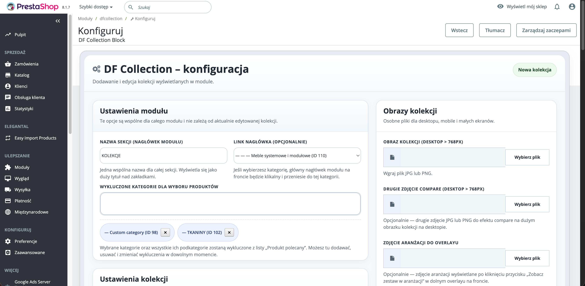
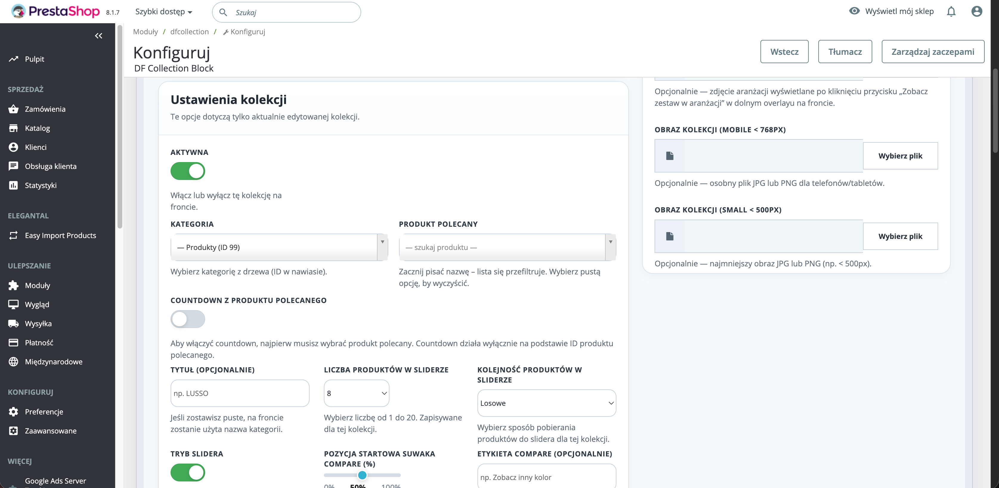
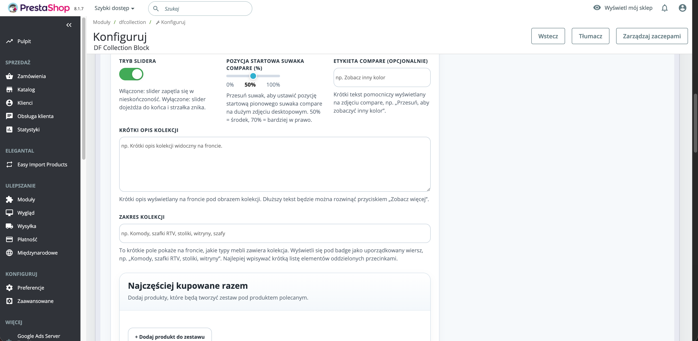
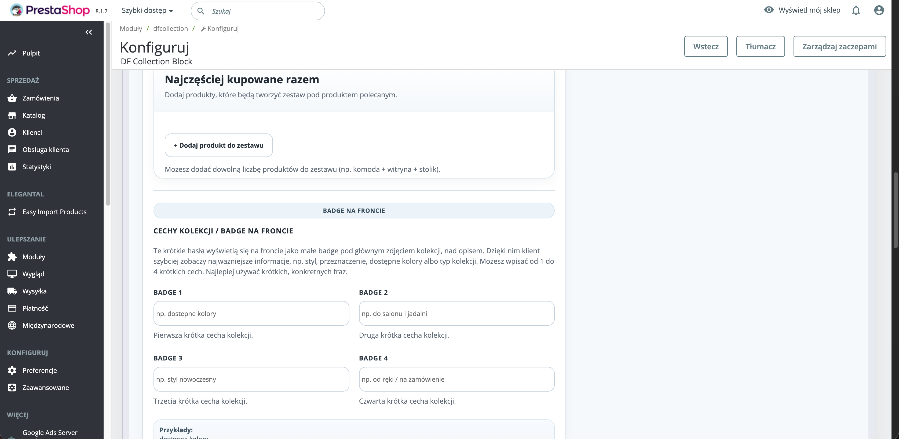
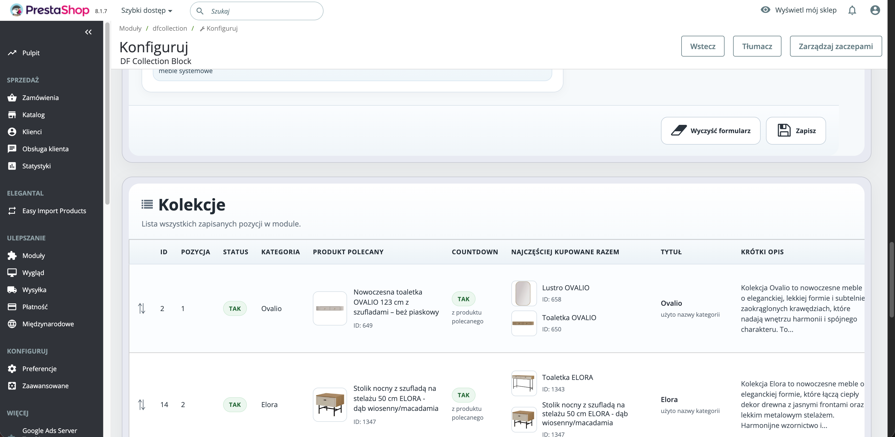
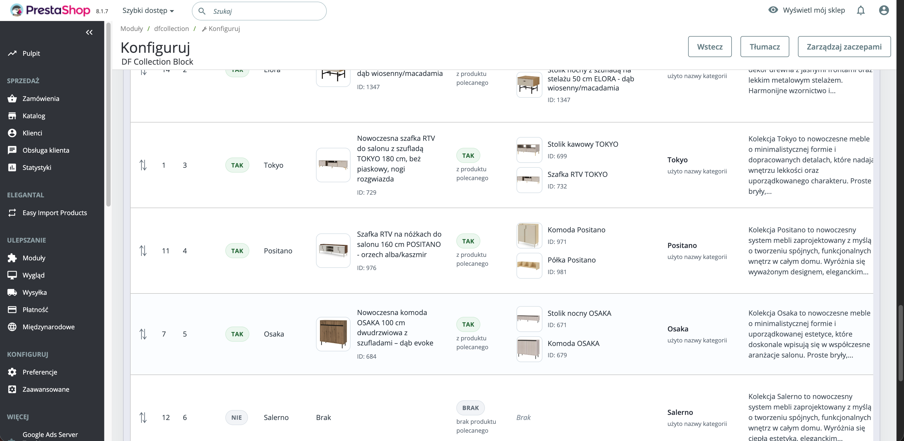
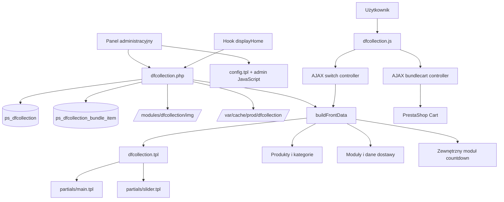
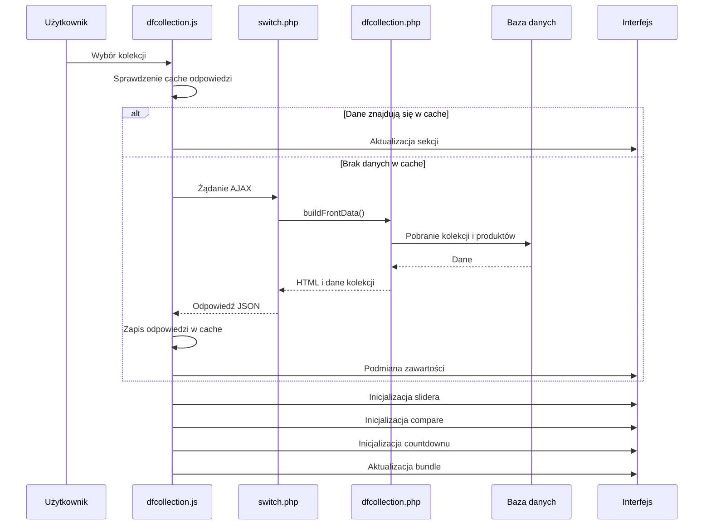

<p align="right">
  <a href="README_EN.md">🇬🇧 English</a> | <strong>🇵🇱 Polski</strong>
</p>

# DF Collection

Zaawansowany moduł PrestaShop do tworzenia interaktywnych sekcji kolekcji produktowych na stronie głównej sklepu.


## O projekcie

**DF Collection** to autorski moduł PrestaShop, który przekształca standardową prezentację kategorii w rozbudowaną sekcję sprzedażową na stronie głównej sklepu.

Każda kolekcja może posiadać własne zdjęcia, opis, cechy, produkt polecany, slider produktów, countdown, porównanie obrazów oraz zestaw produktów „Najczęściej kupowane razem”.

Przełączanie kolekcji odbywa się asynchronicznie. Moduł aktualizuje zawartość sekcji bez pełnego przeładowania strony, zachowując przy tym obsługę sliderów, countdownów, cen, dostawy, bundle oraz interaktywnych elementów interfejsu.

Moduł został zaprojektowany jako centralny blok wizualny i sprzedażowy na homepage sklepu meblowego.

## Status produkcyjny

Moduł działa w środowisku produkcyjnym sklepu opartego na:

- PrestaShop 8.1.7,
- PHP 8,
- Smarty,
- MySQL,
- JavaScript i AJAX,
- Slick Slider,
- Select2,
- Sortable.

Projekt obsługuje wiele aktywnych kolekcji oraz rozbudowaną konfigurację z poziomu panelu administracyjnego.

## Najważniejsze możliwości

- wiele niezależnych kolekcji produktowych,
- powiązanie kolekcji z kategoriami PrestaShop,
- asynchroniczne przełączanie kolekcji,
- sticky bar nawigacyjny,
- duże obrazy responsywne,
- osobne obrazy desktop, mobile i small,
- interaktywny tryb porównania dwóch obrazów,
- overlay ze zdjęciem aranżacji,
- produkt polecany,
- opcjonalny countdown produktu polecanego,
- slider produktów z wybranej kategorii,
- konfigurowalne sortowanie produktów,
- informacja o najniższej cenie kolekcji,
- informacja o progu darmowej dostawy,
- cechy kolekcji prezentowane jako badge,
- zakres produktowy kolekcji,
- sekcja „Najczęściej kupowane razem”,
- dynamiczne obliczanie ceny zestawu,
- dodawanie wielu produktów do koszyka,
- kopiowanie całych kolekcji,
- fizyczne duplikowanie plików obrazów,
- sortowanie kolekcji metodą drag-and-drop,
- własny cache HTML,
- responsywny panel administracyjny.

## Podgląd panelu administracyjnego

### Ustawienia modułu i obrazy kolekcji




Panel umożliwia ustawienie wspólnego nagłówka sekcji, linku prowadzącego do kategorii oraz kategorii wykluczonych z wyszukiwania produktów.

Dla każdej kolekcji można wgrać osobne obrazy dla różnych szerokości ekranu oraz dodatkowe zdjęcia wykorzystywane przez tryb compare i overlay aranżacji.

### Główna konfiguracja kolekcji



Każda kolekcja może zostać powiązana z kategorią i produktem polecanym. Administrator określa również limit produktów, sposób sortowania, tryb slidera oraz parametry porównania obrazów.

### Opis, zakres i zestawy produktowe



Formularz umożliwia dodanie krótkiego opisu, zakresu kolekcji oraz produktów tworzących zestaw „Najczęściej kupowane razem”.

### Badge kolekcji



Każda kolekcja może otrzymać maksymalnie cztery krótkie cechy prezentowane na froncie w formie badge.

### Lista kolekcji



Panel administracyjny prezentuje zapisane kolekcje wraz z ich statusem, kategorią, produktem polecanym, countdownem, bundle oraz opisem.

### Zarządzanie większą liczbą kolekcji



Kolekcje mogą być aktywowane, edytowane, kopiowane, usuwane i sortowane metodą drag-and-drop.

## Funkcjonalności frontowe

### Dynamiczne przełączanie kolekcji

Zmiana aktywnej kolekcji nie powoduje pełnego przeładowania strony.

Dedykowany kontroler AJAX pobiera i zwraca między innymi:

- główny blok kolekcji,
- obrazy,
- produkt polecany,
- slider produktów,
- countdown,
- dane cenowe,
- dane darmowej dostawy,
- badge,
- zakres kolekcji,
- krótki opis,
- produkty bundle,
- podsumowanie zestawu.

Odpowiedzi AJAX mogą być przechowywane w pamięci po stronie klienta, dzięki czemu ponowne otwarcie wcześniej załadowanej kolekcji jest szybsze.

### Sticky bar kolekcji

Podczas przewijania strony moduł wyświetla dodatkowy pasek nawigacyjny.

Sticky bar:

- pojawia się po przewinięciu głównych zakładek,
- znika przed końcem sekcji modułu,
- wyświetla nazwy dostępnych kolekcji,
- posiada licznik aktywnej pozycji,
- obsługuje nawigację poprzednia/następna,
- pozostaje zsynchronizowany z głównymi zakładkami,
- obsługuje poziome przewijanie na mniejszych ekranach,
- posiada własny scrollbar,
- nie nachodzi na kolejne sekcje strony.

### Responsywne obrazy kolekcji

Administrator może przypisać osobne obrazy dla:

- desktopu,
- urządzeń mobilnych,
- najmniejszych ekranów.

Pozwala to kontrolować sposób kadrowania i prezentacji kolekcji niezależnie dla każdej szerokości ekranu.

### Tryb porównania obrazów

Kolekcja może posiadać dodatkowe zdjęcie porównawcze.

Po jego skonfigurowaniu użytkownik otrzymuje interaktywny suwak umożliwiający porównanie dwóch obrazów.

Administrator może ustawić:

- drugie zdjęcie,
- początkową pozycję suwaka,
- tekst etykiety pomocniczej.

### Produkt polecany

Każda kolekcja może mieć przypisany główny produkt polecany.

Produkt polecany:

- jest prezentowany jako wyróżniona karta,
- posiada link do strony produktu,
- jest wykluczany ze standardowego slidera tej samej kolekcji,
- może być źródłem danych dla countdownu,
- posiada dynamiczny podgląd w panelu administracyjnym.

### Countdown produktu polecanego

Countdown jest bezpośrednio powiązany z aktualnym produktem polecanym.

Nie posiada osobnego wyboru produktu, dzięki czemu konfiguracja pozostaje spójna i jednoznaczna.

Po zmianie kolekcji:

1. pobierany jest nowy HTML countdownu,
2. zawartość zostaje podmieniona w DOM,
3. skrypt countdownu jest inicjalizowany ponownie,
4. moduł przechodzi przez techniczne stany `loading` i `ready`.

Ogranicza to migotanie oraz skakanie interfejsu podczas inicjalizacji.

W panelu administracyjnym opcja countdownu jest niedostępna do momentu wskazania produktu polecanego.

### Slider produktów

Produkty slidera są pobierane z kategorii przypisanej do kolekcji.

Dostępne sposoby sortowania:

- pozycja w kategorii,
- kolejność losowa,
- najnowsze produkty,
- cena rosnąco,
- cena malejąco,
- bestsellery.

Administrator może również określić:

- limit od 1 do 20 produktów,
- tryb standardowy,
- tryb zapętlony.

Produkt polecany jest automatycznie pomijany w sliderze.

### Najniższa cena w kolekcji

Moduł analizuje aktywne produkty przypisane do kategorii kolekcji i wyznacza najniższą cenę.

Obsługiwane są:

- aktualna najniższa cena,
- cena regularna,
- aktywna promocja,
- wartość lub etykieta rabatu.

Dane aktualizują się automatycznie po zmianie kolekcji.

### Darmowa dostawa

Moduł może pobierać próg darmowej dostawy dla aktualnej kolekcji z zewnętrznego modułu dostaw.

Wartość jest liczona osobno dla każdej kategorii i aktualizowana razem z pozostałymi danymi AJAX.

### Krótki opis i zakres kolekcji

Kolekcja może posiadać:

- krótki opis prezentowany pod głównym obrazem,
- możliwość rozwinięcia dłuższej treści,
- uporządkowaną listę typów produktów znajdujących się w kolekcji.

### Badge kolekcji

Administrator może dodać cztery krótkie cechy kolekcji.

Przykładowe zastosowania:

- dostępne kolory,
- styl nowoczesny,
- do salonu i jadalni,
- produkt dostępny od ręki.

Badge umożliwiają szybkie przedstawienie najważniejszych właściwości oferty.

### Zdjęcie aranżacji

Dla kolekcji można dodać osobne zdjęcie aranżacji.

Po kliknięciu przycisku użytkownik otrzymuje pełnoekranowy overlay prezentujący produkty jako gotowy zestaw we wnętrzu.

### Najczęściej kupowane razem

Każda kolekcja może posiadać własny zestaw produktów.

Dla każdego elementu administrator określa:

- produkt,
- opcjonalną własną etykietę,
- aktywność,
- pozycję.

Na froncie użytkownik może:

- zaznaczać i odznaczać produkty,
- sprawdzać cenę łączną,
- sprawdzać cenę regularną,
- zobaczyć wyliczoną oszczędność,
- sprawdzać informację o dostawie,
- dodać wybrane produkty do koszyka jednym przyciskiem.

## Panel administracyjny

Panel modułu został zbudowany jako dedykowany interfejs, niezależny od standardowych formularzy PrestaShop.

Obejmuje:

### Ustawienia wspólne

- nagłówek sekcji,
- link nagłówka,
- wykluczone kategorie produktów.

### Ustawienia kolekcji

- status aktywności,
- kategoria,
- produkt polecany,
- countdown produktu polecanego,
- własny tytuł,
- limit slidera,
- sortowanie produktów,
- tryb infinite,
- parametry compare,
- krótki opis,
- zakres kolekcji,
- cztery badge,
- produkty bundle.

### Obrazy

- obraz desktop,
- obraz mobile,
- obraz small,
- drugie zdjęcie compare,
- zdjęcie aranżacji.

### Zarządzanie rekordami

- tworzenie,
- edycja,
- kopiowanie,
- usuwanie,
- aktywacja i dezaktywacja,
- sortowanie drag-and-drop.

## Kopiowanie kolekcji

Moduł umożliwia utworzenie kompletnej kopii istniejącej kolekcji.

Podczas kopiowania:

- tworzony jest nowy rekord,
- kopia trafia na koniec listy,
- otrzymuje dopisek informujący o skopiowaniu,
- domyślnie pozostaje nieaktywna,
- kopiowane są wszystkie ustawienia,
- kopiowane są elementy bundle,
- lokalne obrazy są fizycznie duplikowane.

Moduł nie zapisuje jedynie tych samych adresów URL.

Dla każdego lokalnego obrazu wykonywane jest rzeczywiste kopiowanie pliku, dzięki czemu oryginał i kopia pozostają od siebie niezależne.

Usunięcie lub zmiana obrazu w kopii nie wpływa na oryginalną kolekcję.

## Zarządzanie obrazami

Moduł obsługuje pliki:

- JPG,
- PNG.

Podczas uploadu:

1. sprawdzana jest poprawność przesłanego pliku,
2. weryfikowany jest jego rozmiar,
3. sprawdzany jest typ MIME,
4. generowana jest unikalna nazwa,
5. plik zapisywany jest w katalogu modułu,
6. nowy adres URL trafia do bazy danych.

Pliki są przechowywane w:

```text
/modules/dfcollection/img/
```

Podczas usuwania kolekcji moduł usuwa również należące do niej lokalne obrazy.

## Architektura



## Przepływ przełączania kolekcji



## Główne komponenty

### `dfcollection.php`

Centralny plik modułu odpowiedzialny za:

- instalację,
- strukturę bazy danych,
- migracje,
- rejestrację hooków,
- render sekcji homepage,
- konfigurację panelu administracyjnego,
- zapis kolekcji,
- kopiowanie i usuwanie,
- upload obrazów,
- obsługę bundle,
- budowanie danych frontowych,
- cache HTML.

### `controllers/front/switch.php`

Kontroler obsługujący asynchroniczną zmianę kolekcji.

Zwraca dane w formacie JSON, w tym:

- HTML głównego bloku,
- HTML slidera,
- tytuł kolekcji,
- licznik produktów,
- dane obrazów,
- countdown,
- dane cenowe,
- dane dostawy,
- bundle.

### `controllers/front/bundlecart.php`

Kontroler odpowiedzialny za dodawanie wybranych produktów zestawu do koszyka.

### `views/js/dfcollection.js`

Główna warstwa interakcji frontowej.

Odpowiada między innymi za:

- AJAX switching,
- cache odpowiedzi,
- preload obrazów,
- sticky bar,
- nawigację strzałkami,
- licznik kolekcji,
- animacje przejść,
- tryb compare,
- inicjalizację Slick Slider,
- lazy loading,
- ręczne kropki slidera,
- rozwijanie opisu,
- overlay aranżacji,
- obliczenia bundle,
- dodawanie bundle do koszyka,
- podmianę cen,
- podmianę badge,
- aktualizację dostawy,
- ponowną inicjalizację countdownu,
- synchronizację interfejsu po zmianie DOM.

### `views/templates/admin/config.tpl`

Szablon panelu administracyjnego zawierający:

- formularz kolekcji,
- pola uploadu,
- podglądy produktów,
- Select2,
- konfigurację bundle,
- tabelę kolekcji,
- akcje edycji, kopiowania i usuwania.

### `views/js/dfc-admin-sort.js`

Obsługuje:

- sortowanie drag-and-drop,
- wysyłkę nowych pozycji przez AJAX,
- inicjalizację funkcji pomocniczych panelu.

## Struktura modułu

```text
dfcollection/
├── controllers/
│   └── front/
│       ├── bundlecart.php
│       └── switch.php
├── img/
├── views/
│   ├── css/
│   │   ├── admin.css
│   │   └── dfcollection.css
│   ├── js/
│   │   ├── dfc-admin-sort.js
│   │   └── dfcollection.js
│   └── templates/
│       ├── admin/
│       │   └── config.tpl
│       └── hook/
│           ├── dfcollection.tpl
│           └── partials/
│               ├── main.tpl
│               └── slider.tpl
├── docs/
│   └── images/
├── config_pl.xml
├── dfcollection.php
├── README.md
└── README_EN.md
```

Rzeczywista struktura może zawierać dodatkowe pliki techniczne zależne od wersji modułu.

## Hooki PrestaShop

### `displayHome`

Renderuje główną sekcję kolekcji na stronie głównej.

### `displayHeader`

Ładuje zasoby frontowe:

- arkusz CSS,
- JavaScript,
- definicje JavaScript,
- adres kontrolera `switch`,
- adres kontrolera `bundlecart`.

### `displayBackOfficeHeader`

Ładuje zasoby panelu administracyjnego:

- CSS admina,
- JavaScript admina,
- jQuery,
- Select2,
- Sortable.

## Baza danych

### `ps_dfcollection`

Główna tabela kolekcji.

Najważniejsze pola:

| Pole | Zastosowanie |
|---|---|
| `id_dfcollection` | Identyfikator kolekcji |
| `position` | Pozycja na liście |
| `active` | Status aktywności |
| `id_category` | Powiązana kategoria |
| `id_featured_product` | Produkt polecany |
| `show_featured_countdown` | Włączenie countdownu |
| `title` | Własny tytuł kolekcji |
| `image_url` | Obraz desktop |
| `image_url_mobile` | Obraz mobile |
| `image_url_xs` | Obraz small |
| `image_compare_url` | Drugi obraz compare |
| `arrangement_image_url` | Zdjęcie aranżacji |
| `compare_start_percent` | Pozycja startowa suwaka |
| `compare_label` | Etykieta trybu compare |
| `slider_limit` | Limit produktów |
| `slider_infinite` | Tryb zapętlenia |
| `slider_sort` | Sposób sortowania |
| `short_description` | Krótki opis |
| `collection_scope` | Zakres kolekcji |
| `badge_1`–`badge_4` | Cechy kolekcji |

Prefiks tabeli może być inny niż `ps_`, zależnie od konfiguracji instalacji PrestaShop.

### `ps_dfcollection_bundle_item`

Tabela produktów w zestawach.

| Pole | Zastosowanie |
|---|---|
| `id_dfcollection_bundle_item` | Identyfikator elementu |
| `id_dfcollection` | Powiązana kolekcja |
| `id_product` | Produkt PrestaShop |
| `custom_label` | Własna etykieta |
| `position` | Kolejność |
| `active` | Status aktywności |

## Cache

Moduł posiada własny cache HTML dla hooka `displayHome`.

Domyślna lokalizacja:

```text
/var/cache/prod/dfcollection/
```

Klucz cache uwzględnia między innymi:

- sklep,
- język,
- walutę,
- grupy klientów,
- wersję,
- czas ostatniej zmiany danych modułu.

Cache jest unieważniany po operacjach takich jak:

- zapis kolekcji,
- kopiowanie,
- usuwanie,
- zmiana kolejności,
- aktualizacja konfiguracji.

Mechanizm `mtime` pozwala unieważnić wcześniejsze pliki cache bez konieczności ręcznego zarządzania każdym kluczem.

## Integracje

### Moduł darmowej dostawy

DF Collection może pobierać próg darmowej dostawy dla kategorii aktualnej kolekcji.

Integracja jest wykonywana tylko wtedy, gdy odpowiedni moduł jest zainstalowany i dostępny.

### Dane dostawy produktów

Dla produktów znajdujących się w bundle moduł może pobierać:

- tekst dostawy,
- koszt dostawy,
- próg darmowej dostawy,
- automatyczny tekst listingowy.

### Moduł countdown

Countdown produktu polecanego jest renderowany przez hook zewnętrznego modułu.

Po zmianie kolekcji przez AJAX wykonywana jest ponowna inicjalizacja jego warstwy JavaScript.

## Instalacja

1. Skopiuj katalog modułu do:

```text
/modules/dfcollection/
```

2. Zaloguj się do panelu administracyjnego PrestaShop.

3. Przejdź do:

```text
Moduły → Menedżer modułów
```

4. Wyszukaj `DF Collection`.

5. Zainstaluj i skonfiguruj moduł.

6. Upewnij się, że moduł jest podpięty do hooka:

```text
displayHome
```

Podczas instalacji moduł:

- tworzy wymagane tabele,
- zapisuje wartości domyślne,
- rejestruje hooki,
- przygotowuje katalog obrazów.

## Wymagania

- PrestaShop 8.x,
- PHP 8.x,
- MySQL lub MariaDB,
- włączony JavaScript w przeglądarce,
- prawa zapisu do katalogu modułu,
- prawa zapisu do katalogu cache,
- dostępność hooka `displayHome`.

Niektóre funkcje wymagają opcjonalnych modułów zewnętrznych, na przykład modułu countdown lub modułu danych dostawy.

## Bezpieczeństwo i walidacja

Moduł uwzględnia między innymi:

- walidację typów przesyłanych plików,
- kontrolę MIME,
- generowanie unikalnych nazw obrazów,
- usuwanie wyłącznie plików lokalnych należących do modułu,
- rzutowanie identyfikatorów numerycznych,
- korzystanie z metod zapytań PrestaShop,
- kontrolę aktywności rekordów,
- walidację danych wejściowych kontrolerów AJAX,
- oddzielenie logiki przełączania kolekcji od operacji koszyka.

## Obsługiwane scenariusze

Moduł uwzględnia między innymi sytuacje, w których:

- kolekcja nie posiada produktu polecanego,
- countdown jest wyłączony,
- kategoria nie posiada aktywnych produktów,
- brak jest obrazu mobilnego,
- brak jest obrazu compare,
- brak jest zdjęcia aranżacji,
- kolekcja nie posiada produktów bundle,
- produkt polecany znajduje się również w kategorii slidera,
- odpowiedź AJAX została już pobrana wcześniej,
- zewnętrzny moduł dostawy jest niedostępny,
- zewnętrzny moduł countdown wymaga ponownej inicjalizacji,
- slider musi zostać zniszczony i utworzony ponownie,
- kolekcja jest kopiowana razem z lokalnymi obrazami,
- rekord kolekcji jest usuwany wraz z zależnymi danymi.

## Kluczowe decyzje projektowe

### Oddzielne kontrolery AJAX

Przełączanie kolekcji i dodawanie zestawu do koszyka zostały rozdzielone na dwa kontrolery.

Ułatwia to:

- utrzymanie kodu,
- walidację,
- obsługę błędów,
- rozwój kolejnych operacji AJAX.

### Fizyczne kopiowanie obrazów

Podczas duplikowania kolekcji moduł tworzy nowe pliki zamiast ponownie używać tych samych adresów.

Zapobiega to przypadkowemu usunięciu obrazu wykorzystywanego przez oryginalny rekord.

### Cache z wersjonowaniem `mtime`

Zmiana danych aktualizuje znacznik czasu konfiguracji. Dzięki temu kolejne żądania korzystają z nowego klucza cache bez skomplikowanej ewidencji wszystkich istniejących plików.

### Ponowna inicjalizacja po zmianie DOM

Elementy zależne od JavaScript, takie jak:

- slider,
- countdown,
- compare,
- bundle,
- lazy loading,

są inicjalizowane ponownie po każdej podmianie zawartości przez AJAX.

## Technologie

- PHP 8,
- PrestaShop Module API,
- Smarty,
- MySQL,
- JavaScript ES6,
- AJAX,
- jQuery,
- Slick Slider,
- Select2,
- Sortable,
- HTML5,
- CSS3.

## Możliwe kierunki rozwoju

- pełny overlay kolekcji ładowany przez AJAX,
- dodatkowy quick view produktów,
- konfiguracja bundle z rabatem zestawowym,
- wielojęzyczne pola opisów i badge,
- obsługa WebP i AVIF,
- automatyczna optymalizacja przesyłanych obrazów,
- statystyki kliknięć kolekcji,
- analityka wyboru produktów bundle,
- lazy loading kolejnych kolekcji,
- osobny serwis odpowiedzialny za budowanie danych frontowych,
- przeniesienie całej logiki inline JavaScript do osobnych plików,
- testy integracyjne kontrolerów AJAX,
- automatyczne testy instalacji i migracji bazy danych.

## Charakter projektu

Projekt został wykonany jako dedykowane rozwiązanie komercyjne dla działającego sklepu internetowego.

Repozytorium pełni funkcję prezentacji architektury, sposobu organizacji kodu oraz zakresu funkcjonalnego autorskiego modułu PrestaShop.

Kod nie jest standardowym modułem marketplace i może zawierać integracje specyficzne dla środowiska docelowego.

## Autor

**Damian Perużyński**

Projekt i implementacja autorskiego modułu PrestaShop:

- architektura backendu,
- panel administracyjny,
- kontrolery AJAX,
- integracja z katalogiem produktów,
- logika bundle,
- obsługa obrazów,
- cache,
- interfejs użytkownika,
- responsywność,
- integracje z pozostałymi modułami sklepu.
