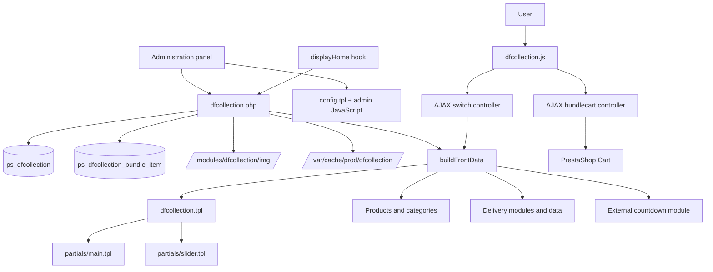
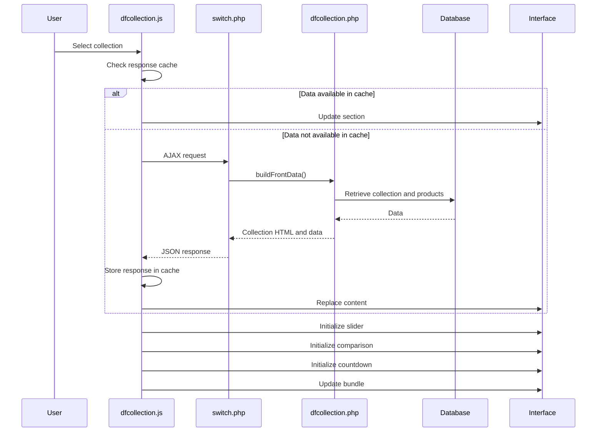

<p align="right">
  <strong>🇬🇧 English</strong> | <a href="README.md">🇵🇱 Polski</a>
</p>

# DF Collection

Advanced PrestaShop module for creating interactive product collection sections on the store homepage.


## About the project

**DF Collection** is a custom PrestaShop module that transforms a standard category presentation into an advanced sales-oriented section displayed on the store homepage.

Each collection can have its own images, description, features, featured product, product slider, countdown, image comparison and a “Frequently bought together” product bundle.

Collections are switched asynchronously. The module updates the section without a full page reload while preserving slider, countdown, pricing, delivery, bundle and other interactive interface functionality.

The module was designed as a central visual and sales component for the homepage of a furniture store.

## Production status

The module is running in a production environment based on:

- PrestaShop 8.1.7,
- PHP 8,
- Smarty,
- MySQL,
- JavaScript and AJAX,
- Slick Slider,
- Select2,
- Sortable.

The project supports multiple active collections and extensive configuration through a dedicated administration panel.

## Key features

- multiple independent product collections,
- integration with PrestaShop categories,
- asynchronous collection switching,
- sticky collection navigation bar,
- large responsive collection images,
- separate desktop, mobile and small-screen images,
- interactive image comparison mode,
- arrangement image overlay,
- featured product,
- optional featured product countdown,
- product slider based on the selected category,
- configurable product sorting,
- lowest collection price information,
- free shipping threshold information,
- collection features displayed as badges,
- product scope description,
- “Frequently bought together” section,
- dynamic bundle price calculation,
- adding multiple products to the cart,
- complete collection duplication,
- physical duplication of image files,
- drag-and-drop collection sorting,
- custom HTML cache,
- responsive administration panel.

## Administration panel preview

### Module settings and collection images


The panel allows the administrator to define a shared section heading, a heading category link and categories excluded from product selection.

Each collection can have separate images for different screen widths, as well as additional images used by the comparison mode and arrangement overlay.

### Main collection configuration


Each collection can be linked to a category and a featured product. The administrator can also configure the product limit, sorting method, slider mode and image comparison parameters.

### Description, scope and product bundles


The form allows the administrator to add a short description, define the collection scope and select products for the “Frequently bought together” bundle.

### Collection badges


Each collection can have up to four short features displayed on the storefront as badges.

### Collection list


The administration panel displays saved collections together with their status, category, featured product, countdown, bundle and description.

### Managing multiple collections


Collections can be activated, edited, duplicated, deleted and reordered using drag-and-drop.

## Front-office functionality

### Dynamic collection switching

Changing the active collection does not trigger a full page reload.

A dedicated AJAX controller retrieves and returns data such as:

- the main collection block,
- images,
- featured product,
- product slider,
- countdown,
- pricing data,
- free shipping data,
- badges,
- collection scope,
- short description,
- bundle products,
- bundle summary.

AJAX responses can be stored in client-side memory, making previously loaded collections faster to reopen.

### Sticky collection navigation

While the user scrolls through the page, the module displays an additional navigation bar.

The sticky bar:

- appears after the main collection tabs have been scrolled past,
- disappears before the end of the module section,
- displays the names of available collections,
- includes an active position counter,
- supports previous and next navigation,
- remains synchronized with the main tabs,
- supports horizontal scrolling on smaller screens,
- includes a custom scrollbar,
- does not overlap subsequent page sections.

### Responsive collection images

The administrator can assign separate images for:

- desktop,
- mobile devices,
- the smallest screens.

This makes it possible to control image cropping and presentation independently for each viewport size.

### Image comparison mode

A collection can include an additional comparison image.

Once configured, the storefront displays an interactive slider that allows users to compare two images.

The administrator can configure:

- the second image,
- the initial slider position,
- a helper label.

### Featured product

Each collection can have one featured product.

The featured product:

- is displayed as a highlighted product card,
- links to the product page,
- is excluded from the standard collection slider,
- can provide data for the countdown,
- has a dynamic preview in the administration panel.

### Featured product countdown

The countdown is directly linked to the currently selected featured product.

It does not have a separate product selector, keeping the configuration consistent and unambiguous.

After switching collections:

1. new countdown HTML is retrieved,
2. the content is replaced in the DOM,
3. the countdown script is initialized again,
4. the module transitions through the technical `loading` and `ready` states.

This reduces interface flickering and layout jumping during initialization.

In the administration panel, the countdown option remains unavailable until a featured product has been selected.

### Product slider

Slider products are loaded from the category assigned to the collection.

Available sorting methods:

- category position,
- random order,
- newest products,
- price ascending,
- price descending,
- bestsellers.

The administrator can also define:

- a limit of 1 to 20 products,
- standard mode,
- infinite loop mode.

The featured product is automatically excluded from the slider.

### Lowest collection price

The module analyzes active products assigned to the collection category and determines the lowest price.

It supports:

- current lowest price,
- regular price,
- active discount,
- discount value or label.

The data is automatically refreshed after switching collections.

### Free shipping information

The module can retrieve the free shipping threshold for the active collection from an external delivery module.

The value is calculated separately for each category and is updated together with the remaining AJAX data.

### Short description and collection scope

A collection can contain:

- a short description displayed below the main image,
- expandable longer content,
- an organized list of product types included in the collection.

### Collection badges

The administrator can add four short collection features.

Example uses:

- available colors,
- modern style,
- suitable for living and dining rooms,
- available for immediate shipment.

Badges make it possible to present the most important characteristics of the offer at a glance.

### Arrangement image

A separate arrangement image can be uploaded for each collection.

After clicking the corresponding button, the user sees a full-screen overlay presenting the products as a complete interior arrangement.

### Frequently bought together

Each collection can have its own product bundle.

For every bundle item, the administrator can define:

- the product,
- an optional custom label,
- active status,
- position.

On the storefront, users can:

- select and deselect products,
- view the total price,
- view the regular price,
- see the calculated savings,
- check delivery information,
- add all selected products to the cart with one button.

## Administration panel

The module administration interface was built as a dedicated panel independent of standard PrestaShop forms.

It includes:

### Shared settings

- section heading,
- heading link,
- excluded product categories.

### Collection settings

- active status,
- category,
- featured product,
- featured product countdown,
- custom title,
- slider limit,
- product sorting,
- infinite mode,
- comparison settings,
- short description,
- collection scope,
- four badges,
- bundle products.

### Images

- desktop image,
- mobile image,
- small-screen image,
- secondary comparison image,
- arrangement image.

### Record management

- creating,
- editing,
- duplicating,
- deleting,
- activating and deactivating,
- drag-and-drop sorting.

## Collection duplication

The module can create a complete copy of an existing collection.

During duplication:

- a new database record is created,
- the copy is placed at the end of the list,
- the title receives a copy suffix,
- the duplicated collection is inactive by default,
- all settings are copied,
- bundle items are copied,
- local images are physically duplicated.

The module does not simply reuse the same image URLs.

Every local image file is actually copied, which keeps the original collection and its duplicate independent from each other.

Deleting or changing an image in the duplicate does not affect the original collection.

## Image management

The module supports:

- JPG,
- PNG.

During upload:

1. the uploaded file is validated,
2. its size is checked,
3. the MIME type is verified,
4. a unique filename is generated,
5. the file is saved in the module directory,
6. the new URL is stored in the database.

Files are stored in:

```text
/modules/dfcollection/img/
```

When a collection is deleted, the module also removes the local image files assigned to that collection.

## Architecture



## Collection switching flow



## Main components

### `dfcollection.php`

The central module file responsible for:

- installation,
- database structure,
- migrations,
- hook registration,
- homepage section rendering,
- administration panel configuration,
- collection persistence,
- duplication and deletion,
- image uploads,
- bundle handling,
- front-office data building,
- HTML caching.

### `controllers/front/switch.php`

Controller responsible for asynchronous collection switching.

It returns JSON data containing:

- main block HTML,
- slider HTML,
- collection title,
- product count,
- image data,
- countdown,
- pricing data,
- delivery data,
- bundle information.

### `controllers/front/bundlecart.php`

Controller responsible for adding selected bundle products to the cart.

### `views/js/dfcollection.js`

The main front-office interaction layer.

It is responsible for:

- AJAX switching,
- response caching,
- image preloading,
- sticky navigation,
- arrow navigation,
- collection counter,
- transition animations,
- image comparison mode,
- Slick Slider initialization,
- lazy loading,
- custom slider dots,
- description expansion,
- arrangement overlay,
- bundle calculations,
- adding bundles to the cart,
- price replacement,
- badge replacement,
- delivery information updates,
- countdown reinitialization,
- interface synchronization after DOM replacement.

### `views/templates/admin/config.tpl`

Administration panel template containing:

- collection form,
- image upload fields,
- product previews,
- Select2 integration,
- bundle configuration,
- collection table,
- edit, duplicate and delete actions.

### `views/js/dfc-admin-sort.js`

Responsible for:

- drag-and-drop sorting,
- sending updated positions through AJAX,
- initializing administration panel helper functions.

## Module structure

```text
dfcollection/
├── controllers/
│   └── front/
│       ├── bundlecart.php
│       └── switch.php
├── img/
├── views/
│   ├── css/
│   │   ├── admin.css
│   │   └── dfcollection.css
│   ├── js/
│   │   ├── dfc-admin-sort.js
│   │   └── dfcollection.js
│   └── templates/
│       ├── admin/
│       │   └── config.tpl
│       └── hook/
│           ├── dfcollection.tpl
│           └── partials/
│               ├── main.tpl
│               └── slider.tpl
├── docs/
│   └── images/
├── config_pl.xml
├── dfcollection.php
├── README.md
└── README_EN.md
```

The actual structure may contain additional technical files depending on the module version.

## PrestaShop hooks

### `displayHome`

Renders the main collection section on the homepage.

### `displayHeader`

Loads front-office resources:

- module stylesheet,
- JavaScript,
- JavaScript definitions,
- `switch` controller URL,
- `bundlecart` controller URL.

### `displayBackOfficeHeader`

Loads administration panel resources:

- administration CSS,
- administration JavaScript,
- jQuery,
- Select2,
- Sortable.

## Database

### `ps_dfcollection`

Main collection table.

Key fields:

| Field | Purpose |
|---|---|
| `id_dfcollection` | Collection identifier |
| `position` | Position in the collection list |
| `active` | Active status |
| `id_category` | Related category |
| `id_featured_product` | Featured product |
| `show_featured_countdown` | Enables the countdown |
| `title` | Custom collection title |
| `image_url` | Desktop image |
| `image_url_mobile` | Mobile image |
| `image_url_xs` | Small-screen image |
| `image_compare_url` | Secondary comparison image |
| `arrangement_image_url` | Arrangement image |
| `compare_start_percent` | Initial comparison slider position |
| `compare_label` | Comparison helper label |
| `slider_limit` | Product limit |
| `slider_infinite` | Infinite slider mode |
| `slider_sort` | Product sorting method |
| `short_description` | Short collection description |
| `collection_scope` | Collection product scope |
| `badge_1`–`badge_4` | Collection features |

The database prefix may differ from `ps_`, depending on the PrestaShop installation configuration.

### `ps_dfcollection_bundle_item`

Table containing bundle products.

| Field | Purpose |
|---|---|
| `id_dfcollection_bundle_item` | Bundle item identifier |
| `id_dfcollection` | Related collection |
| `id_product` | PrestaShop product |
| `custom_label` | Custom storefront label |
| `position` | Item position |
| `active` | Active status |

## Cache

The module includes a custom HTML cache for the `displayHome` hook.

Default location:

```text
/var/cache/prod/dfcollection/
```

The cache key includes information such as:

- shop,
- language,
- currency,
- customer groups,
- module version,
- last module data modification time.

The cache is invalidated after operations such as:

- saving a collection,
- duplicating a collection,
- deleting a collection,
- changing collection order,
- updating module configuration.

The `mtime` mechanism invalidates previous cache files without requiring manual management of every existing cache key.

## Integrations

### Free shipping module

DF Collection can retrieve the free shipping threshold for the category assigned to the active collection.

The integration is used only when the corresponding module is installed and available.

### Product delivery data

For products included in a bundle, the module can retrieve:

- delivery text,
- delivery cost,
- free shipping threshold,
- automatic listing delivery text.

### Countdown module

The featured product countdown is rendered through a hook provided by an external module.

After an AJAX collection switch, the countdown JavaScript layer is initialized again.

## Installation

1. Copy the module directory to:

```text
/modules/dfcollection/
```

2. Log in to the PrestaShop administration panel.

3. Navigate to:

```text
Modules → Module Manager
```

4. Search for `DF Collection`.

5. Install and configure the module.

6. Make sure the module is attached to:

```text
displayHome
```

During installation, the module:

- creates the required database tables,
- stores default configuration values,
- registers the required hooks,
- prepares the image directory.

## Requirements

- PrestaShop 8.x,
- PHP 8.x,
- MySQL or MariaDB,
- JavaScript enabled in the browser,
- write permissions for the module directory,
- write permissions for the cache directory,
- availability of the `displayHome` hook.

Some features require optional external modules, such as a countdown module or a delivery information module.

## Security and validation

The module includes measures such as:

- uploaded file type validation,
- MIME type verification,
- generation of unique image filenames,
- deletion restricted to local files owned by the module,
- numeric identifier casting,
- use of PrestaShop database query methods,
- active record validation,
- AJAX controller input validation,
- separation of collection switching logic from cart operations.

## Supported scenarios

The module handles situations where:

- the collection has no featured product,
- the countdown is disabled,
- the category has no active products,
- no mobile image is configured,
- no comparison image is configured,
- no arrangement image is configured,
- the collection has no bundle products,
- the featured product also belongs to the slider category,
- the AJAX response has already been loaded,
- the external delivery module is unavailable,
- the external countdown module requires reinitialization,
- the slider must be destroyed and initialized again,
- a collection is duplicated together with its local images,
- a collection record is deleted together with its dependent data.

## Key design decisions

### Separate AJAX controllers

Collection switching and adding bundle products to the cart are handled by two separate controllers.

This improves:

- maintainability,
- validation,
- error handling,
- future development of additional AJAX operations.

### Physical image duplication

When a collection is duplicated, the module creates new image files instead of reusing the same URLs.

This prevents accidental deletion of images still used by the original collection.

### Cache versioning with `mtime`

Every relevant data change updates the module modification timestamp. New requests therefore use a new cache key without requiring complex tracking of every existing cache file.

### Reinitialization after DOM replacement

JavaScript-dependent elements such as:

- slider,
- countdown,
- image comparison,
- bundle,
- lazy loading,

are initialized again after every AJAX content replacement.

## Technologies

- PHP 8,
- PrestaShop Module API,
- Smarty,
- MySQL,
- JavaScript ES6,
- AJAX,
- jQuery,
- Slick Slider,
- Select2,
- Sortable,
- HTML5,
- CSS3.

## Possible future improvements

- full collection overlay loaded through AJAX,
- additional product quick view,
- bundle discount configuration,
- multilingual descriptions and badges,
- WebP and AVIF support,
- automatic optimization of uploaded images,
- collection click statistics,
- bundle selection analytics,
- lazy loading of additional collections,
- a dedicated service responsible for building front-office data,
- moving all inline JavaScript into separate files,
- integration tests for AJAX controllers,
- automated installation and database migration tests.

## Project nature

This project was developed as a dedicated commercial solution for a live online store.

The repository serves as a presentation of the architecture, code organization and functionality of a custom PrestaShop module.

It is not a standard marketplace module and may contain integrations specific to the target environment.

## Author

**Damian Perużyński**

Design and implementation of the custom PrestaShop module, including:

- backend architecture,
- administration panel,
- AJAX controllers,
- product catalog integration,
- bundle logic,
- image management,
- caching,
- user interface,
- responsive behavior,
- integration with other store modules.
